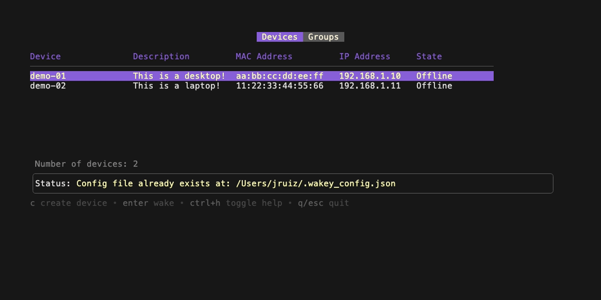

# wakey

A TUI built on Charm CLI tools for managing and waking your devices using Wake-on-LAN.


## What is Wake-on-LAN?

Wake-on-LAN (WoL) is an Ethernet or Token Ring computer networking standard that allows a computer to be turned on or awakened by a network message.

The computer is woken up by sending a "magic packet" that contains the MAC address of the target computer. The magic packet is sent on the broadcast address of the network, and the target computer will turn on if the MAC address matches.

## Installation

### MacOS

For MacOS users, you can install `wakey` using Homebrew:

```bash
# Tap the repository
brew tap jonathanruiz/wakey

# Install wakey
brew install wakey
```

For manual installation, you can install `wakey` using the `install.sh` script:

```bash
# Clone the repository
git clone https://github.com/jonathanruiz/wakey.git

# Change directory to the wakey folder
cd wakey

# Modify the permissions of the install script to make it executable
chmod +x install.sh

# Run the install script
sudo ./install.sh
```

## Running the application

To run the application, you can use the following command:

```bash
wakey
```


## Usage

### List of devices

Running the application will immediately display a list of devices that you can wake up. Within the application, you be able to add your own devices along with additional details.

You can navigate through the list using the arrow keys or VIM motions navigation and press `Enter` to wake up the selected device.

### Refreshing the list

When in the list view, you can press `r` to refresh the list of devices. This will update the status of the devices in the list to determine if they are online or offline. The way the application determines if a device is online or offline is by pinging the device's IP address.

### View more keybindings

You can also press `ctrl + h` to display all the available keybindings. Keybidings vary between different parts of the applicaiton so make sure to check the keybindings when you are in a specific view.



## Configuration

When running `wakey` for the first time, a configuration file will be created with a list of empty devices. After the first run, `wakey` will use the configuration file to store and retrieve the devices.

The configuration file is located in your home directory at `~/.wakey_config.json`.

You can add your own devices to the configuration file by adding the following JSON object:

```json
{
  "devices": [
    {
      "DeviceName": "Device Name",
      "Description": "Description",
      "MACAddress": "00:00:00:00:00:00",
      "IPAddress": "0.0.0.0",
      "Status": "Offline"
    }
  ]
}
```

- `DeviceName` is the name of the device that you want to wake up.
- `Description` is a brief description of the device.
- `MACAddress` is the MAC address of the device.
- `IPAddress` is the IP address of the device.
- `Status` is the status of the device. This will be updated by the application. It will ping the device to determine if it is online or offline.

## Contributing

If you would like to contribute to the project, please feel free to fork the repository and submit a pull request.
