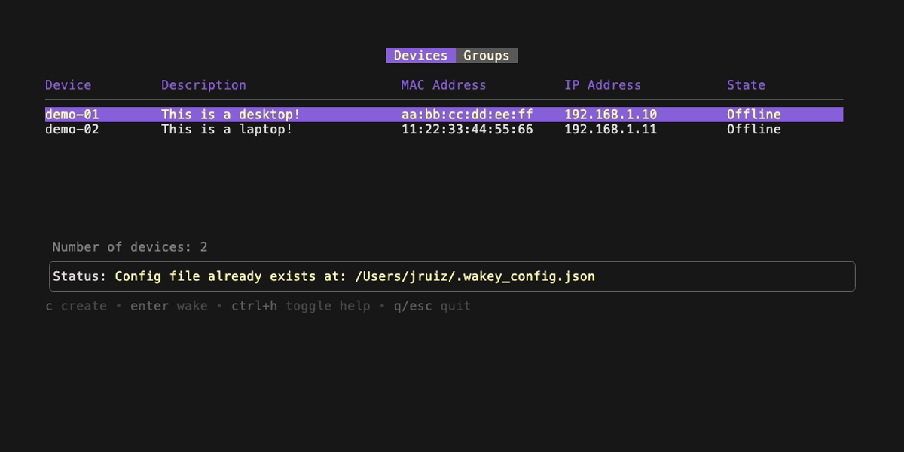

# wakey

A TUI built on Charm CLI tools for managing and waking your devices using Wake-on-LAN.


## What is Wake-on-LAN?

Wake-on-LAN (WoL) is an Ethernet or Token Ring computer networking standard that allows a computer to be turned on or awakened by a network message.

The computer is woken up by sending a "magic packet" that contains the MAC address of the target computer. The magic packet is sent on the broadcast address of the network, and the target computer will turn on if the MAC address matches.

## Installation

### MacOS Installation

For MacOS users, you can install `wakey` using Homebrew:

```bash
# Tap the repository
brew tap jonathanruiz/wakey

# Install wakey
brew install wakey
```

For manual installation, you can install `wakey` using the `install.sh` script:

```bash
# Clone the repository
git clone https://github.com/jonathanruiz/wakey.git

# Change directory to the wakey folder
cd wakey

# Modify the permissions of the install script to make it executable
chmod +x install.sh

# Run the install script
sudo ./install.sh
```

## Running the application

To run the application, you can use the following command:

```bash
wakey
```


## Usage

### Navigating between devices and groups

You can either wake up individual devices or groups of devices. When you first run the application, you will be presented with a list of devices. You can easily switch between the list of devices and groups by pressing `tab`.



You can then use VIM motions or the up or down arrow keys to navigate between the individual devices or groups. To wake up a device or group of devices, press `Enter`.

### Creating a new device or group

When in the list view, you can press `n` to create a new device or group. You will then be prompted to enter the details of the device or group.

When creating a new device, you will be prompted to enter the the `Device Name`, `Description`, `MAC Address`, and `IP Address` of the device.

When creating a new group, you will be prompted to enter the `Group Name` and `Devices`. Select the devices that you want to add to the group by entering the device name. If you want to add multiple devices to the group, separate the device names with a comma.

There is validation on all the fields and it will not allow you to create a device without all the fields filled out correctly. If there is field that is not filled out correctly, an error message will be displayed aside the field that needs to be corrected.

### Refreshing the list

When in the list view, you can press `r` to refresh the list of devices. This will update the status of the devices in the list to determine if they are online or offline. The way the application determines if a device is online or offline is by pinging the device's IP address.

### View more keybindings

You can also press `ctrl + h` to display all the available keybindings. Keybindings vary between different parts of the application so make sure to check the keybindings when you are in a specific view.


## Configuration

When running `wakey` for the first time, a configuration file will be created with a list of empty devices. After the first run, `wakey` will use the configuration file to store and retrieve the devices.

The configuration file is located in your home directory at `~/.wakey_config.json`.

You can add your own devices to the configuration file by adding the following JSON object:

```json
{
  "devices": [
    {
      "ID": "11111111-2222-3333-4444-555555555555",
      "DeviceName": "Device Name",
      "Description": "Description",
      "MACAddress": "00:00:00:00:00:00",
      "IPAddress": "0.0.0.0",
      "Status": "Offline"
    }
  ],
  "groups": [
    {
      "ID": "aaaaaaaa-bbbb-cccc-dddd-eeeeeeeeeeee",
      "GroupName": "Group Name",
      "Devices": ["11111111-2222-3333-4444-555555555555"]
    }
  ]
}
```

The JSON object contains two arrays: `devices` and `groups`.

### Devices

- `ID` is a unique identifier for the device. This is a UUID that is generated by the application.
- `DeviceName` is the name of the device that you want to wake up.
- `Description` is a brief description of the device.
- `MACAddress` is the MAC address of the device.
- `IPAddress` is the IP address of the device.
- `Status` is the status of the device. This will be updated by the application. It will ping the device to determine if it is online or offline.

### Groups

- `ID` is a unique identifier for the group. This is a UUID that is generated by the application.
- `GroupName` is the name of the group.
- `Devices` is an array of device IDs that are part of the group.

## FAQS

### How do I enable Wake-on-LAN on my computer?

First of all, you need to make sure that your computer supports Wake-on-LAN. Most modern computers support Wake-on-LAN, but you may need to enable it in the BIOS settings. Check with your computer's manufacturer for more information on how to enable Wake-on-LAN in the BIOS as the steps may vary from computer to computer. This will apply for both Windows and Linux machines but for MacOS computers, you can [enable Wake-on-LAN in the System Settings](#enable-wol-on-macos).

#### Enable WoL on Windows

For Windows computers, you can enable Wake-on-LAN by following these steps:

1. Open the Device Manager by searching for "Device Manager" in the search bar.
2. Expand the "Network adapters" section.
3. Right-click on your network adapter and select "Properties".
4. Click on the "Power Management" tab.
5. Uncheck the box that says "Allow the computer to turn off this device to save power".
6. Check the box that says "Allow this device to wake the computer".
7. Click "OK" to save the changes.

#### Enable WoL on MacOS

For MacOS computers, you can enable Wake-on-LAN by following these steps:

1. Open the System Settings.
2. Click on "Battery".
3. Select the "Options..." button.
4. Select the "Wake for network access" dropdown and choose "Always".

#### Enable WoL on Linux

Due to the variety of Linux distributions, the steps to enable Wake-on-LAN may vary. I suggest you look up the instructions for your specific distribution, but the general idea is the same.

I suggest you check out Techno Tim's blog on how to enable Wake-on-LAN on Linux [here](https://technotim.live/posts/wake-on-lan/#waking-up-a-linux-machine).

### How do I find the MAC address of my computer?

To find the MAC Address of your Windows or MacOS machine, you can do so through by following these steps.

#### Find MAC Address on Windows

1. Open the Command Prompt by searching for "cmd" in the search bar.
2. Type `ipconfig /all` and press Enter.
3. Look for the "Physical Address" under the network adapter that you are using.

#### Find MAC Address on MacOS

1. Open the Terminal.
2. Type `ifconfig` and press Enter.
3. Look for the device that you are using (usually `en0` or `en1`) and look for the "ether" field. Alternatively, you can search for the network adapter that has the IP address that you are using. Once you find the network adapter, look for the "ether" field and that value is your MAC address.

#### Find MAC Address on Linux

Instructions may vary for the different flavors of Linux. I suggest you look up the instructions for your specific distribution, but the general idea is the same.

### My Windows computer is online but `wakey` says it is offline. Why can't I ping it?

If you are trying to wake up a Windows computer, you may need to enable ICMPv4 Echo Requests in the Windows Firewall settings. You can do this by following these steps:

1. Open the Windows Firewall settings by searching for "Windows Defender Firewall with Advanced Security" in the search bar.
2. Click on "Inbound Rules" on the left side of the window.
3. Scroll down to "File and Printer Sharing (Echo Request - ICMPv4-In)" and enable the rule.

Additionally, you may need to make sure that your computer is not connected to a public network. If you are connected to a public network, the Windows Firewall will block all incoming ICMP requests. To change the network profile, follow these steps:

1. Open the Windows Settings.
2. Click on "Network & Internet".
3. Click on "Wi-Fi" or "Ethernet" depending on your connection.
4. From here you can switch the network profile to "Private network".

For security reasons, only change this setting if you are on a trusted network.

## Contributing

If you would like to contribute to the project, please feel free to fork the repository and submit a pull request.
